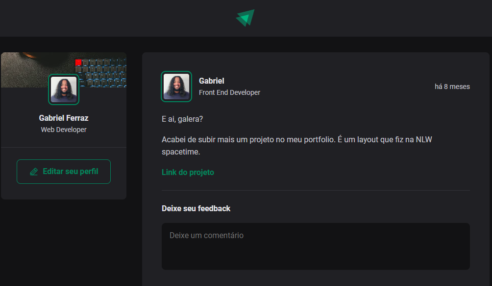

<strong><h1 align="center"> Ignite </h1></strong>

  

O projeto foi feito com base no curso "Ignite" da RocketSeat, consiste em um layout típico de rede social, possuindo funcionalidades como apagar ou excluir comentários e deixar "likes". 

Além da minha própria imagem, para tornar o projeto mais crível e verossimilhante, utilizel também a imagem do meu amado amigo [Lucas Adorno](https://github.com/LucasAdorno), confira também os projetos dele!

---
## Tecnologias
O presente projeto foi criado utilizando as tecnologias: 
<ul>
<li>React</li>
<li>Typescript</li>
<li>Vite</li>
<li>CSS Modules</li>
</ul>

---

Acesse o projeto através desse [Link.](https://ignite-pwyr-gabrielferrazdev.vercel.app)

